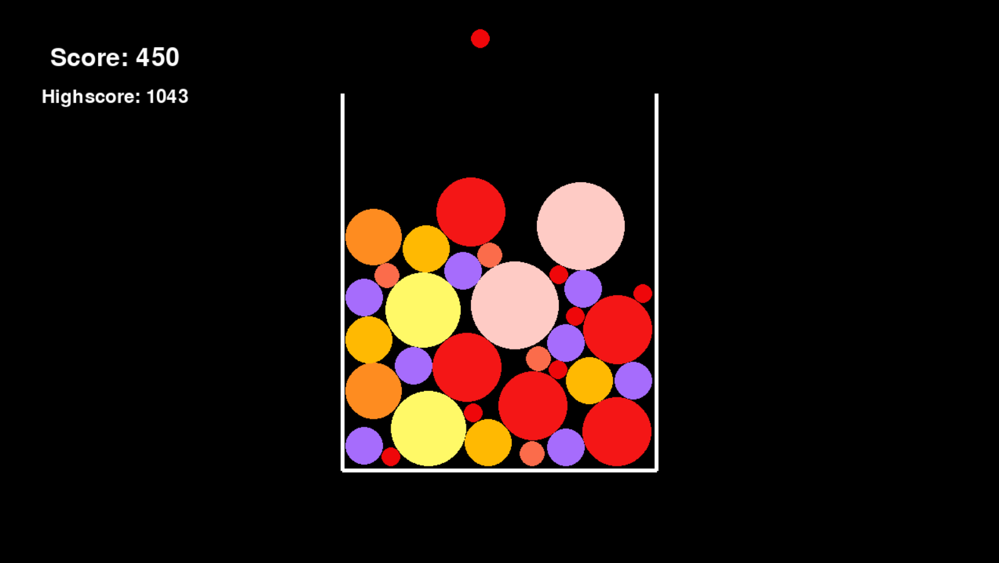

# Suika Clone

A basic Suika game clone made using Python, Pygame, and Pymunk.

## Screenshots

## Roadmap

    1. Allow the user to drop fruits [DONE]
     a. The fruit follows the cursor at a fixed-y position. [DONE]
     b. When the left-mouse button is pressed the fruit falls down. [DONE]
     c. Increase the probability of lower tier fruits to spawn.
    
    2. Constrain the play area [DONE]
     a. Create a "box" that restricts where fruit can be dropped and be moved to. [DONE]
     b. The rectangle borders are collideable and have infinite mass, no fruit should be able to pass through it. [DONE]
     c. Large fruit are able to roll off the edge of the container. [DONE]
    
    3. Physics [DONE]
     a. Fruits not yet dropped have no physics and simply follow the x-position of the cursor. [DONE]
        - Have the cursor replicate the image of the fruit. [DONE]
     b. Upon a mouse press the fruit's physics is enabled, it initally should have no external velocity other than gravity. [DONE]
     c. Fruits are able to collide with each other, the larger the fruit the larger the mass. [DONE]

    4. Fruit Merges [DONE]
     a. Allow fruits to be merged into higher tiers. [DONE]
     b. New fruits spawn at the collision point of the two collided fruits. [DONE]
    
    5. Scoring
     a. When fruits merge add a certain number of points to the score. [DONE]
     b. Store the user's highscore locally. [DONE]
    
    6. Game loop
     a. When a player drops a fruit and it intersects with the maximum height of the boundary end the game. [DONE]
     b. Show the user their score when they lose and a way of restarting. [DONE]

    7. GUI & Art
     a. Add art for fruits.
     b. Add art for the environment (background, boundaries, etc.).
     c. Make proper GUI.